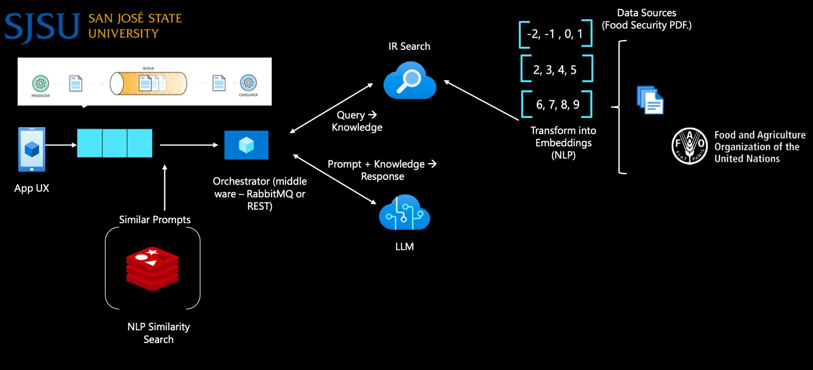

# RAG-with-cahing-queuing

This project contains a simple RabbitMQ consumer script that listens to a specified queue and prints the content of each message it receives. It is designed to work with a RabbitMQ server running locally and allows easy integration for monitoring message flow in distributed systems.

## Prerequisites

To run this consumer script, you need to have the following installed:

1. **Python 3.7+**
2. **RabbitMQ Server** running locally or accessible via a network connection.
3. **pika** Python library for interfacing with RabbitMQ.

## Installation

1. **Clone the repository**:

   ```sh
   git clone <repository-url>
   cd <repository-folder>
   ```

2. **Install required Python packages**:

   You need to install the `pika` library to interact with RabbitMQ. You can do so by running the following command:

   ```sh
   pip install pika
   ```

## Running the System

To properly use this system, you need to follow these steps:

1. **Start RabbitMQ Server**:

   Make sure that RabbitMQ is installed and running on your local machine. If you installed RabbitMQ using Homebrew, you can start it using:

   ```sh
   brew services start rabbitmq
   ```

2. **Run the Consumer Script**:

   After ensuring RabbitMQ is running, you can start the consumer script by running the following command:

   ```sh
   python rabbitmq_consumer.py
   ```

   You should see the output:

   ```
   INFO:root:Waiting for messages. To exit press CTRL+C
   ```

   The consumer will continuously listen for messages. When a message is received, it will be printed to the console with the log message:

   ```
   INFO:root:Received message: <message-content>
   ```

3. **Run the Streamlit Application**:

   Finally, run the Streamlit application that pushes messages to RabbitMQ. This application is responsible for sending user questions to the `question_queue`:

   ```sh
   streamlit run <your_streamlit_app.py>
   ```

   Once the Streamlit app is running, you can interact with it to push messages to RabbitMQ, and the consumer script will pick them up and process them accordingly.

## Script Explanation

The script (`consumer.py`) performs the following actions:

1. Establishes a connection to a RabbitMQ server running on `localhost` using the `pika` library.
2. Declares a queue named `question_queue` if it does not already exist.
3. Defines a callback function that logs the message received.
4. Starts consuming messages from the `question_queue`, printing each message to the console.

## Architecture Overview

This project is part of a larger architecture that involves:

1. **Information Retrieval (IR) System with FAISS**: We use FAISS to build an index of document chunks, which allows for efficient similarity searches. This enables us to quickly retrieve relevant pieces of information to answer user questions.

2. **Large Language Model (LLM) Integration**: After retrieving relevant document chunks using FAISS, we use a Large Language Model (LLM) to generate responses based on the retrieved content. This combination allows us to provide accurate and context-rich answers.

3. **Caching with Redis**: We use Redis as a caching layer to store previously processed questions and their answers. This helps reduce latency for frequently asked questions by avoiding re-processing and allows for quicker responses.

4. **Message Queue with RabbitMQ**: The consumer script listens to messages from RabbitMQ. We push user questions into RabbitMQ from the main system, and this script consumes those messages to trigger different operations such as retrieving data from FAISS or invoking the LLM for an answer.

## Code Overview

Below is a brief overview of the main components of the script:

- **RabbitMQ Connection**: The script connects to RabbitMQ running locally on the default port:

  ```python
  connection = pika.BlockingConnection(pika.ConnectionParameters(host='localhost'))
  channel = connection.channel()
  channel.queue_declare(queue='question_queue')
  ```

- **Callback Function**: The callback function is invoked each time a message is received from the queue:

  ```python
  def callback(ch, method, properties, body):
      logger.info(f"Received message: {body.decode('utf-8')}")
  ```

- **Start Consuming**: The script begins consuming messages and runs indefinitely:

  ```python
  channel.basic_consume(queue='question_queue', on_message_callback=callback, auto_ack=True)
  channel.start_consuming()
  ```

## Customization

- **Queue Name**: If you want to change the name of the queue, modify the `queue` parameter in both `queue_declare` and `basic_consume` methods.

- **RabbitMQ Host**: If RabbitMQ is not running locally, update the `host` parameter in `pika.ConnectionParameters()` to the appropriate hostname or IP address.

## Troubleshooting

- **Connection Issues**: Ensure RabbitMQ is running and accessible. You can verify the RabbitMQ status with:
  
  ```sh
  sudo service rabbitmq-server status
  ```

- **Dependency Issues**: Ensure that all required packages are installed. You can use the command:
  
  ```sh
  pip install -r requirements.txt
  ```

  Create a `requirements.txt` file if needed:
  
  ```
  pika==1.2.0
  ```

## Architecture




## Acknowledgments

- [RabbitMQ](https://www.rabbitmq.com/) for message brokering.
- [pika](https://pika.readthedocs.io/en/stable/) Python library for RabbitMQ connections.
- [Redis](https://redis.io/) for caching and enhancing response speed.


